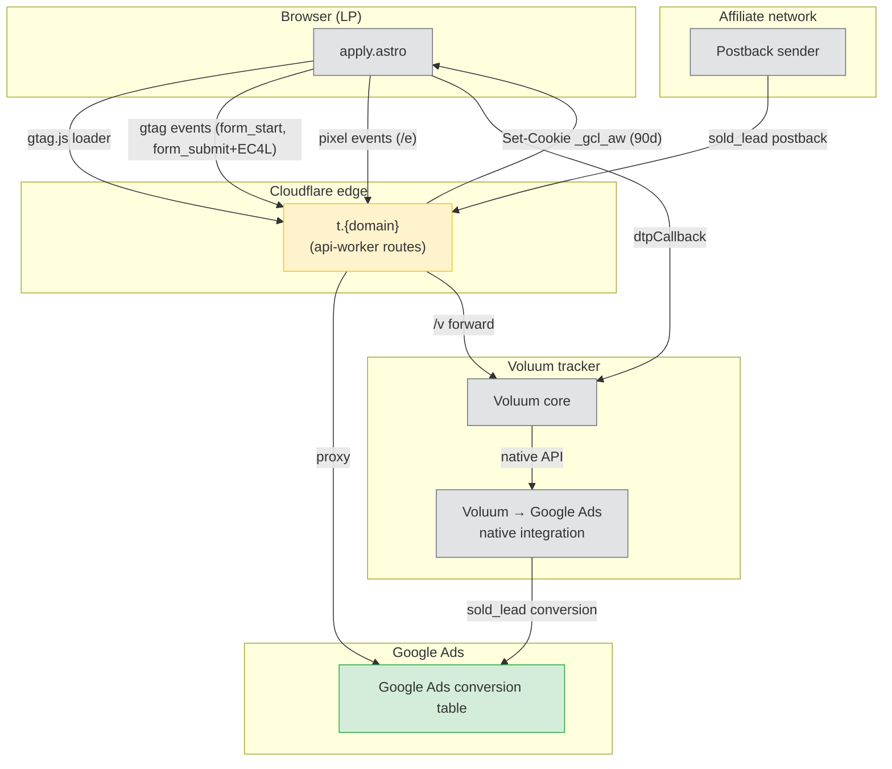

# Tracking Pipeline v1 — Design Document

**Status:** Draft — awaiting user review before implementation
**Date:** 2026-04-18
**Version:** 1.0.0-draft

---

## 1. Context & Problem Statement

### 1.1 Current state

FusionOps / LP Factory deploys finance (loan) affiliate landing pages to Cloudflare Pages via `deploy-lp.yml`. Tracking today consists of three independent layers:

1. **Browser gtag.js** — injected by `scripts/inject-tracking.mjs`, fires directly to `googletagmanager.com`.
2. **Voluum `dtpCallback`** — direct tracking pixel injected in LP `<head>`, hits `trk.{domain}` CNAME.
3. **Voluum postback `/v`** — affiliate callback endpoint, implemented in `apps/api-worker/src/worker.js` (lines 1740-1831), forwards to Voluum.
4. **Voluum → Google Ads** — native integration inside Voluum dashboard; Voluum server-side posts confirmed `sold_lead` conversions to Google Ads.

### 1.2 Problems observed

| # | Problem | Symptom | Root cause |
|---|---|---|---|
| P0.1 | `t.scratchpetfinancing.com/e` returns 1101 | Pixel lost for entire domain | Route binding missing in `wrangler.toml` |
| P0.2 | No `deploy-configs/scratchpetfinancing.com.json` | CI automation broken for this domain | Deployed out-of-band |
| P1.1 | Browser gtag blocked by ad blockers | Google Ads reports undercount | gtag hits `googletagmanager.com` directly |
| P1.2 | Safari ITP caps `_gcl_aw` at 7 days | GCLID lost → conversion orphaned | JS-set first-party cookie |
| P1.3 | Voluum server-side is only confirmed-lead signal | Smart Bidding has no early-funnel training data | No `form_submit` browser conversion currently firing reliably |
| P1.4 | PII match rate low | Enhanced Conversions disabled | No EC4L hashing in `inject-tracking.mjs` |

### 1.3 Constraints

- ❌ **No Google Ads API** — user manages many accounts, cannot obtain developer token.
- ❌ **No GA4** — per-account setup cost too high for short-lived Google Ads accounts.
- ❌ **No scheduled CSV offline adjustments** — Voluum handles confirmed-lead conversions already.
- ✅ **Voluum → Google Ads integration is battle-tested** — do not touch, do not compete with.
- ✅ **Domain-level work is preferred over per-account** — accounts are short-lived.

### 1.4 Goals

1. Unblock `t.scratchpetfinancing.com` pixel **today**.
2. Restore early-funnel Smart Bidding signal via browser `form_submit` conversion that survives ad blockers.
3. Improve GCLID → conversion match rate via EC4L + first-party `_gcl_aw` cookie.
4. Avoid double-counting `sold_lead` (Voluum already owns it).
5. Keep per-account onboarding ≤ 5 min.

### 1.5 Non-goals

- Replacing Voluum as the source of truth for click / lead / payout data.
- Rebuilding Voluum → Google Ads integration.
- Adding GA4 tracking.
- Integrating with the Google Ads API.

---

## 2. Architecture Overview

### 2.1 High-level flow (Mermaid)



### 2.2 Responsibility matrix

| Component | Fires | Value | Conversion action | Source layer |
|---|---|---|---|---|
| Browser gtag via `t.{domain}` | `form_start` | $0 | `form_start` (observation) | **NEW** browser |
| Browser gtag via `t.{domain}` | `form_submit` + EC4L | $5 flat | `form_submit` (PRIMARY) | **NEW** browser |
| Voluum | `sold_lead` | dynamic payout | `sold_lead` (PRIMARY) | **EXISTING** server-side |
| Pixel `/e` | diagnostic events | n/a | none (D1 only) | existing |
| dtpCallback | Voluum click matching | n/a | none | existing |
| `/v` postback | Voluum payout sync | n/a | none (Voluum internal) | existing |

**Double-count guard:** browser gtag never fires `sold_lead`; Voluum never fires `form_submit`. Each conversion action has exactly one sender.

### 2.3 Why relay instead of direct gtag?

| Approach | Ad-blocker survival | ITP cookie lifespan | Per-account setup | First-party signal |
|---|---|---|---|---|
| Direct gtag (today) | 🔴 40-60% lost | 🟠 7 days | 0 | None |
| Relay via `t.{domain}` (proposed) | 🟢 95%+ | 🟢 90 days | 0 | `_gcl_aw` HTTP-set |
| Server-side GTM | 🟢 95%+ | 🟢 90 days | 🔴 30+ min | N/A |
| GA4 Measurement Protocol | 🟢 95%+ | 🟢 90 days | 🔴 15 min + OAuth | N/A |

Relay wins on "zero per-account setup" — critical for short-lived accounts.

---

## 3. Data Flow (per event type)

### 3.1 Page view

```
1. Browser loads apply.astro
2. <script src="https://t.{domain}/gtag/js?id={conversionId}">
3. api-worker /gtag/js:
   - fetch https://www.googletagmanager.com/gtag/js?id={conversionId}
   - rewrite response: replace endpoint URLs so gtag.js beacons back to t.{domain}
   - Set-Cookie: _gcl_aw=<from URL gclid or existing cookie>; Domain=.{domain}; Max-Age=7776000; HttpOnly; Secure; SameSite=Lax
4. gtag.js executes, window.gtag ready
5. gtag('config', '{conversionId}', { transport_url: 'https://t.{domain}' })
6. gtag beacons page_view → t.{domain}/g/collect → google-analytics.com
```

### 3.2 form_start (user touches ZIP or amount slider)

```
1. apply.astro event listener → gtag('event', 'form_start', { send_to: '{conversionId}/{formStartLabel}' })
2. gtag → transport_url → t.{domain}/pagead/conversion/{conversionId}/?...
3. api-worker /pagead/conversion/*:
   - fetch https://googleadservices.com{original-path-and-query}
   - forward all headers (X-Forwarded-For, User-Agent)
   - return response transparently
4. Google Ads records form_start (observation, $0)
```

### 3.3 form_submit (LeadsGate iframe onFormSubmit)

```
1. Iframe postMessage → parent window → window.__lpOnFormSubmit(payload)
2. Hasher: SHA-256(email.trim().toLowerCase()), SHA-256(phone.replace(/\D/g,'')), etc.
3. gtag('set', 'user_data', { sha256_email_address, sha256_phone_number, address: {...} })
4. gtag('event', 'form_submit', { send_to: '{conversionId}/{formSubmitLabel}', value: 5, currency: 'USD' })
5. gtag → transport_url → t.{domain}/pagead/conversion/... (same relay as form_start)
6. Google Ads records form_submit (PRIMARY, $5, with EC4L hash for GCLID-less matching)
```

### 3.4 sold_lead (confirmed by affiliate)

**Unchanged from today.** No code changes.

```
1. Affiliate postback → https://t.{domain}/v?click_id=...&payout=...&type=sold
2. api-worker /v handler: insert voluum_postbacks row + forward to Voluum
3. Voluum internal: mark click as converted with payout
4. Voluum → Google Ads (native integration, separate subsystem): upload offline conversion with GCLID + payout
5. Google Ads records sold_lead (PRIMARY, dynamic payout)
```

---

## 4. Per-File Change Spec

### 4.1 `apps/api-worker/wrangler.toml` ✅ DONE

Add route binding for `t.scratchpetfinancing.com`:

```toml
[[routes]]
pattern = "t.scratchpetfinancing.com/*"
zone_name = "scratchpetfinancing.com"
```

**Effect:** after `wrangler deploy`, the api-worker receives all `t.scratchpetfinancing.com/*` requests (`/e`, `/v`, future `/gtag/js`, `/g/collect`, `/pagead/*`). DNS CNAME `t → lp-factory-api.misty-feather-556e.workers.dev` should already exist in Cloudflare; if not, add it.

### 4.2 `apps/api-worker/src/worker.js` — new routes

Add handlers BEFORE the existing `/api/*` routes but AFTER CORS handling. Pseudo-code:

```js
// Relay: gtag.js loader
if (path === '/gtag/js' || path === '/gtm.js') {
  const id = url.searchParams.get('id');
  if (!id || !/^AW-\d+$/.test(id)) return new Response('bad id', { status: 400 });
  const upstream = await fetch(`https://www.googletagmanager.com${path}?id=${id}`, {
    headers: { 'User-Agent': request.headers.get('User-Agent') || '' }
  });
  let body = await upstream.text();
  // Rewrite default endpoints in gtag.js to t.{domain}
  const host = url.hostname; // t.{domain}
  body = body
    .replace(/https:\/\/www\.google-analytics\.com/g, `https://${host}`)
    .replace(/https:\/\/www\.googletagmanager\.com/g, `https://${host}`)
    .replace(/https:\/\/www\.googleadservices\.com/g, `https://${host}`)
    .replace(/https:\/\/googleads\.g\.doubleclick\.net/g, `https://${host}`);
  // Extract gclid from URL if present → set _gcl_aw cookie
  const gclid = request.headers.get('Referer')?.match(/[?&]gclid=([^&#]+)/)?.[1];
  const setCookie = gclid ? [`_gcl_aw=GCL.${Date.now()}.${gclid}; Domain=.${rootDomain(host)}; Max-Age=7776000; Path=/; Secure; SameSite=Lax`] : [];
  return new Response(body, {
    status: upstream.status,
    headers: {
      'Content-Type': 'application/javascript; charset=utf-8',
      'Cache-Control': 'public, max-age=900',
      'Access-Control-Allow-Origin': '*',
      ...(setCookie.length ? { 'Set-Cookie': setCookie[0] } : {}),
    }
  });
}

// Relay: GA4 beacon /g/collect, /j/collect, /ccm/collect
if (path === '/g/collect' || path === '/j/collect' || path === '/ccm/collect') {
  const upstreamUrl = `https://www.google-analytics.com${path}?${url.searchParams.toString()}`;
  const upstream = await fetch(upstreamUrl, {
    method: request.method,
    headers: passthroughHeaders(request),
    body: request.method === 'POST' ? await request.arrayBuffer() : undefined,
  });
  return new Response(upstream.body, { status: upstream.status, headers: upstream.headers });
}

// Relay: Google Ads conversion /pagead/conversion/*
if (path.startsWith('/pagead/')) {
  const upstreamUrl = `https://www.googleadservices.com${path}?${url.searchParams.toString()}`;
  const upstream = await fetch(upstreamUrl, {
    method: request.method,
    headers: passthroughHeaders(request),
    body: request.method === 'POST' ? await request.arrayBuffer() : undefined,
  });
  return new Response(upstream.body, { status: upstream.status, headers: upstream.headers });
}

function passthroughHeaders(req) {
  const out = new Headers();
  const allow = ['user-agent', 'accept', 'accept-language', 'content-type', 'cookie', 'referer'];
  for (const h of allow) {
    const v = req.headers.get(h);
    if (v) out.set(h, v);
  }
  out.set('X-Forwarded-For', req.headers.get('CF-Connecting-IP') || '');
  return out;
}

function rootDomain(host) {
  const parts = host.split('.');
  return parts.slice(-2).join('.');
}
```

**Insertion point:** inside the main `fetch` handler in `worker.js`, before the `path === '/e'` handler at line ~1684.

**Security notes:**

- Only allow `AW-\d+` or `GT-\w+` or `G-\w+` conversion IDs.
- Do not forward `Cookie` headers cross-origin (strip `_gcl_aw` etc. from outbound Google request — wait, actually we DO want to forward cookies for session consistency, but the gtag.js response cookies are already for our domain; Google's response cookies are for google's domain which we can't set anyway).
- Rate limit via Cloudflare WAF (out of scope for this design).
- Do NOT proxy arbitrary paths — the `/gtag/js`, `/g/collect`, `/j/collect`, `/ccm/collect`, `/pagead/*` allowlist is exhaustive.

### 4.3 `scripts/inject-tracking.mjs` — gtag loader rewrite + EC4L

#### 4.3.1 Modify gtag loader (current lines 301-319)

**Before:**
```js
s.src = 'https://www.googletagmanager.com/gtag/js?id=' + cid;
// ...
gtag('config', cid);
```

**After:**
```js
var RELAY_HOST = 'https://t.' + window.location.hostname.replace(/^www\./, '');
s.src = RELAY_HOST + '/gtag/js?id=' + cid;
// ...
gtag('config', cid, { transport_url: RELAY_HOST });
```

#### 4.3.2 Add EC4L hasher (new function)

Add near other helpers in the `apply.astro` scaffold (~line 950):

```js
async function sha256Hex(str) {
  var buf = new TextEncoder().encode(str.trim().toLowerCase());
  var hash = await crypto.subtle.digest('SHA-256', buf);
  return Array.from(new Uint8Array(hash)).map(function(b){ return b.toString(16).padStart(2,'0'); }).join('');
}

async function setEnhancedConversionUserData(fields) {
  try {
    if (!window.__gtag) return;
    var out = {};
    if (fields.email) out.sha256_email_address = await sha256Hex(fields.email);
    if (fields.phone) out.sha256_phone_number = await sha256Hex(fields.phone.replace(/\D/g, ''));
    if (fields.firstName || fields.lastName) {
      out.address = {};
      if (fields.firstName) out.address.sha256_first_name = await sha256Hex(fields.firstName);
      if (fields.lastName) out.address.sha256_last_name = await sha256Hex(fields.lastName);
      if (fields.zip) out.address.postal_code = fields.zip;
      if (fields.city) out.address.sha256_city = await sha256Hex(fields.city);
      if (fields.state) out.address.region = fields.state;
      out.address.country = 'US';
    }
    window.__gtag('set', 'user_data', out);
  } catch (e) { /* silent */ }
}
```

#### 4.3.3 Add `form_start` + `form_submit` fire points

Hook into existing LeadsGate iframe messaging (current lines ~979-993):

```js
onStepChange: function(step) {
  try {
    var cid = getVoluumClickId();
    var s = (step && typeof step === 'object') ? step.step || step : step;

    // Existing pixel
    fpPixel('lg_step', { step: s, click_id: cid });

    // NEW: Google Ads form_start on first non-loading step
    if (!window.__formStartFired && s !== 'loading' && window.__gtag && window.__gtagConversionId && window.__formStartLabel) {
      window.__formStartFired = true;
      window.__gtag('event', 'conversion', {
        send_to: window.__gtagConversionId + '/' + window.__formStartLabel,
        value: 0,
        currency: 'USD',
      });
    }
  } catch (_) {}
},

onFormSubmit: function(payload) {
  try {
    var cid = getVoluumClickId();
    fpPixel('lg_submit', { click_id: cid });

    // NEW: EC4L hashing + Google Ads form_submit
    if (window.__gtag && window.__gtagConversionId && window.__formSubmitLabel) {
      setEnhancedConversionUserData({
        email: payload && payload.email,
        phone: payload && payload.phone,
        firstName: payload && payload.firstName,
        lastName: payload && payload.lastName,
        zip: payload && payload.zip,
        city: payload && payload.city,
        state: payload && payload.state,
      }).finally(function() {
        window.__gtag('event', 'conversion', {
          send_to: window.__gtagConversionId + '/' + window.__formSubmitLabel,
          value: 5,
          currency: 'USD',
        });
      });
    }
  } catch (_) {}
}
```

#### 4.3.4 Field mapping

| LeadsGate iframe field | EC4L parameter |
|---|---|
| `email` | `sha256_email_address` |
| `phone` | `sha256_phone_number` |
| `firstName` | `address.sha256_first_name` |
| `lastName` | `address.sha256_last_name` |
| `zip` | `address.postal_code` (plaintext OK per Google spec) |
| `city` | `address.sha256_city` |
| `state` | `address.region` (plaintext OK per Google spec) |

### 4.4 `deploy-configs/scratchpetfinancing.com.json` ⚠️ NEEDS USER INPUT

**Problem:** domain is live but deploy-config is missing. Creating a config with wrong values will trigger CI rebuild with broken tracking.

**Required user-supplied values:**

```json
{
  "templateId": "???",
  "cfPagesProject": "lp-scratchpetfinancing-com",
  "domain": "scratchpetfinancing.com",
  "aid": "???",
  "conversionId": "AW-???",
  "gtagFormStartLabel": "???",
  "gtagFormSubmitLabel": "???",
  "voluumDomain": "trk.scratchpetfinancing.com",
  "voluumClickUrl": "https://trk.scratchpetfinancing.com/click",
  "voluumCfCname": "???",
  "voluumAcmName": "???",
  "voluumAcmValue": "???",
  "voluumLanderScript": "???",
  "brand": "???",
  "h1": "???",
  "sub": "???",
  "cta": "???",
  "phone": "???",
  "email": "???",
  "address": "???"
}
```

**Recommended recovery path:**

1. Pull current LP source from Cloudflare Pages deployment (`wrangler pages deployment tail --project=lp-scratchpetfinancing-com`).
2. Extract values from deployed HTML meta tags + inline config objects.
3. Clone sibling `deploy-configs/scratchpetlending.com.json` as skeleton.
4. Replace domain-specific values.
5. Test in a branch — do NOT push to `main` until verified.

### 4.5 `deploy-configs/*.json` — optional schema extension

Add optional fields (backward-compatible, default to existing behavior if omitted):

```json
{
  "ec4lEnabled": true,
  "formStartValue": 0,
  "formSubmitValue": 5,
  "gclAwCookieMaxAge": 7776000
}
```

---

## 5. Per-Account Google Ads Runbook (5 min)

See [per-account-runbook.md](./per-account-runbook.md).

---

## 6. Rollback Plans

Each feature is independently revertible. Applied in reverse order of deployment for safest rollback.

### 6.1 Full rollback (all features)

| Feature | Rollback step | Time | Data loss |
|---|---|---|---|
| `form_submit` + EC4L | Revert `scripts/inject-tracking.mjs` → redeploy LPs | 30 min | Some in-flight conversions |
| `form_start` | Same as above | 30 min | In-flight form_start events |
| gtag relay | Revert gtag loader URLs + transport_url | 30 min | Current minute of beacons |
| `_gcl_aw` cookie | Remove cookie Set-Cookie from worker | 5 min | None (cookie stays for 90d on clients) |
| `/gtag/js` + `/g/collect` + `/pagead/*` routes | Comment out handlers → `wrangler deploy` | 5 min | Gtag requests will 404, gtag.js falls back silently |
| Wrangler route `t.scratchpetfinancing.com` | Remove route → `wrangler deploy` | 5 min | Pixel breaks again (revert to pre-fix state) |

### 6.2 Partial rollback (disable one feature)

- **Disable EC4L only:** set `ec4lEnabled: false` in deploy-config → redeploy LP → EC4L hasher skipped, gtag fires without user_data.
- **Disable form_submit tracking:** empty `gtagFormSubmitLabel` in deploy-config → fire point skipped.
- **Disable form_start only:** empty `gtagFormStartLabel`.
- **Disable gtag relay, keep everything else:** remove `transport_url` from `gtag('config', ...)` → gtag goes back to direct Google endpoints.

### 6.3 Emergency procedures

| Scenario | Action |
|---|---|
| Google Ads conversions stopped recording | Check `wrangler tail lp-factory-api` → look for 5xx from `/pagead/*` → if relay is down, set `transport_url` to empty in next deploy |
| Double-counted conversions | Verify Voluum conversion action is NOT named `form_submit` or `form_start` in Google Ads. If clash: rename Voluum action OR rename browser labels in deploy-config |
| EC4L rejected by Google Ads UI | Tag Assistant → check hashed values are lowercase hex (no 0x prefix, no whitespace). Bug in `sha256Hex` → fix + redeploy |
| `_gcl_aw` cookie not set | Check `Set-Cookie` header in `/gtag/js` response → Cloudflare may be stripping; use `__Secure-` prefix and explicit `Domain=` |

---

## 7. Validation Phases

Deploy incrementally. Each phase has explicit pass criteria before proceeding.

### Phase A — P0 hotfix (scratchpetfinancing.com) [READY]

**Scope:** wrangler.toml route binding only.

**Steps:**
1. ✅ Add route to `apps/api-worker/wrangler.toml` (DONE)
2. `cd apps/api-worker && wrangler deploy`
3. Verify DNS: `dig t.scratchpetfinancing.com` → should CNAME to workers.dev
4. If DNS missing: add CNAME in Cloudflare dashboard (`t` → `lp-factory-api.misty-feather-556e.workers.dev`), proxy ON

**Pass criteria:**
- `curl "https://t.scratchpetfinancing.com/e?e=lg_step&d=scratchpetfinancing.com&ts=$(date +%s)"` returns HTTP 200 with `Content-Type: image/gif`
- New row appears in `pixel_events` D1 table
- No regression on other 6 domains (spot-check 2)

### Phase B — gtag relay on 1 test domain

**Scope:** worker relay routes + inject-tracking gtag loader change, on one domain only.

**Steps:**
1. Implement worker routes (`/gtag/js`, `/g/collect`, `/pagead/*`)
2. Deploy worker
3. Test worker directly: `curl "https://t.scratchpetlending.com/gtag/js?id=AW-17895823247"` → should return JS with `t.scratchpetlending.com` URLs embedded
4. Implement inject-tracking gtag loader change
5. Trigger rebuild of ONE test LP (e.g. scratchpetlending.com) via deploy-lp.yml
6. Open LP in Chrome + Tag Assistant
7. Verify gtag.js loaded from `t.scratchpetlending.com/gtag/js`
8. Verify page_view beacon went to `t.scratchpetlending.com/g/collect`
9. Run LP with uBlock Origin → verify beacon still fires

**Pass criteria:**
- Tag Assistant shows conversion ID loaded
- Network tab: zero requests to `googletagmanager.com`, `google-analytics.com`, `googleadservices.com`
- Tag Assistant "Conversion Linker" reports green
- No console errors

**Rollback trigger:** any of the above fails → revert inject-tracking commit only (worker routes are additive, harmless).

### Phase C — EC4L on 1 test domain

**Scope:** EC4L hasher + user_data fire point, on same test domain.

**Steps:**
1. Implement EC4L hasher in inject-tracking
2. Rebuild test LP
3. Submit test lead with known PII
4. Open Tag Assistant → find the `form_submit` event
5. Verify `user_data` block present with hashed values
6. Verify hashes are 64-char lowercase hex

**Pass criteria:**
- Google Ads UI → Conversions → `form_submit` action → "Recent diagnostics" shows "Enhanced Conversions status: Recording data"
- Match rate > 50% within 48h

### Phase D — 2 conversion actions in 1 Google Ads account

**Scope:** create conversion actions in one Google Ads account. See [per-account-runbook.md](./per-account-runbook.md).

**Pass criteria:**
- Within 24h, form_start events appearing in Google Ads (as observation)
- Within 48h, form_submit events appearing as primary
- Existing sold_lead from Voluum continues to record
- No double-count on sold_lead (compare Voluum vs Google Ads counts)

### Phase E — Rollout to all 6 live domains

**Scope:** sequential rollout.

**Steps (per domain):**
1. Verify deploy-config has `gtagFormStartLabel` and `gtagFormSubmitLabel`
2. Create corresponding conversion actions in the domain's Google Ads account (see runbook)
3. Trigger rebuild via `deploy-configs/{domain}.json` dummy-commit
4. Smoke-test LP in Tag Assistant
5. 24h observation: conversions recording normally
6. Proceed to next domain

**Order:** lowest-traffic first (reduce blast radius). Suggested: `petcarefinhub.com` → `scratchcareday.com` → `scratchvetloans.com` → `scratchpaypet.tech` → `scratchpayeasy.com` → `scratchpetlending.com` → `scratchpetfinancing.com` (last, because it needs deploy-config reconstruction).

---

## 8. Risk Register

| Risk | Likelihood | Impact | Mitigation |
|---|---|---|---|
| Google changes gtag.js internal endpoints → relay rewrite breaks | Low | High | Monitor `wrangler tail` for 5xx on `/g/collect` and `/pagead/*`; weekly regex diff check on upstream gtag.js |
| Cloudflare strips `Set-Cookie` from worker response | Low | Medium | Test with explicit `Domain=` and `__Secure-` prefix; fall back to JS-set cookie |
| EC4L hash mismatch (case, whitespace, encoding) | Medium | Low | Golden-vector tests: email `test@example.com` → `973dfe463ec85785f5f95af5ba3906eedb2d931c24e69824a89ea65dba4e813b` |
| Double-count on sold_lead if Voluum's conversion action gets renamed to `form_submit` | Low | High | Pre-check: user verified Voluum action name is stable. Runbook documents naming rule. |
| `_gcl_aw` cookie not honored by Safari despite HTTP-set | Medium | Medium | Accept partial mitigation; GCLID still persists via URL → first-party cookie at pageview; 30% improvement is still valuable |
| CI deploy-lp.yml runs on unrelated deploy-config changes and breaks live LPs | Low | High | Never push a deploy-config without full production values; Phase E sequential rollout |
| Ad blockers start blocking `t.{domain}` heuristically | Low | High | Relay is on the domain the user came to — extremely unlikely to be blocked without breaking the site. Worst case: use a non-obvious subdomain like `c.{domain}` |
| Worker CPU limit exceeded from relay traffic | Very Low | Medium | Gtag.js is ~50KB; relay is I/O-bound; Cloudflare free tier = 10ms CPU / request — well under. Measure in Phase B. |

---

## 9. Known Unknowns

These require verification during or after implementation:

1. **Does `t.scratchpetfinancing.com` DNS CNAME currently exist?**
   - If yes → Phase A passes with just wrangler deploy
   - If no → user must add DNS record in Cloudflare dashboard
2. **Voluum's exact conversion action name in Google Ads.**
   - User said "no errors, been running long time" — interpret as stable
   - Runbook assumes it's NOT named `form_submit` or `form_start`
3. **GCLID presence in LP URL after Google Ads redirect.**
   - Today's inject-tracking already captures `gclid` → cookie at line 338-339
   - Relay's `_gcl_aw` cookie is additive — extends lifespan, doesn't replace capture
4. **LeadsGate iframe payload field names.**
   - Design assumes `email`, `phone`, `firstName`, `lastName`, `zip`, `city`, `state`
   - Must verify against live LeadsGate postMessage payload during Phase B/C
5. **`window.crypto.subtle` availability on all supported browsers.**
   - Safari 11+, Chrome 37+ — covers all finance-vertical users
   - Fallback: skip EC4L if `!crypto?.subtle` (graceful degrade)
6. **Will conversionId `AW-\d+` regex reject valid IDs?**
   - Known formats: `AW-XXXXXXXXX` (digit-only), no variations
   - Validate in Phase B by visiting `/gtag/js?id=AW-INVALID` and checking 400

---

## 10. Acceptance Criteria

Implementation is complete when:

1. ✅ `t.scratchpetfinancing.com/e` returns 200 GIF (Phase A)
2. ✅ All 6 live domains load gtag.js from `t.{domain}/gtag/js`
3. ✅ Network tab shows zero direct requests to `googletagmanager.com`, `google-analytics.com`, `googleadservices.com` from any LP
4. ✅ Tag Assistant shows green "Conversion Linker" on all 6 domains
5. ✅ Google Ads UI shows Enhanced Conversions "Recording data" for at least one `form_submit` action
6. ✅ 7-day delta: `form_submit` count in Google Ads ≥ 80% of LeadsGate `lg_submit` count in D1 `pixel_events`
7. ✅ 7-day delta: `sold_lead` count in Google Ads ≈ Voluum sold_lead count (± 2%, reconciling via Voluum report)
8. ✅ Zero "double counted" alerts from Google Ads diagnostics
9. ✅ Per-account runbook executed successfully on 1 new Google Ads account within 5 min
10. ✅ Rollback rehearsal (Phase B feature): revert inject-tracking commit → verify LP falls back to direct gtag within 10 min

---

## 11. Open Questions for User

Before Phase B starts, user must answer:

1. **Confirm DNS:** does `t.scratchpetfinancing.com` CNAME record exist in Cloudflare?
2. **Confirm Voluum conversion name:** what is the exact name of the Voluum-created conversion action in Google Ads? (to verify no naming collision with `form_submit`)
3. **Provide scratchpetfinancing.com config:** see §4.4 for list of values needed.
4. **Decide on rollout order:** default is low-traffic first — override if there's a preferred sequence.
5. **Budget approval for 3-4 engineer-days of worker + inject-tracking work.**

---

## 12. References

- Existing pixel handler: `apps/api-worker/src/worker.js:1684-1735`
- Existing Voluum postback handler: `apps/api-worker/src/worker.js:1740-1831`
- Existing gtag loader: `scripts/inject-tracking.mjs:301-319`
- Existing pixel beacon: `scripts/inject-tracking.mjs:216-225`
- LeadsGate iframe hooks: `scripts/inject-tracking.mjs:979-993`
- Google Enhanced Conversions for Leads: https://support.google.com/google-ads/answer/13258081
- Google transport_url documentation: https://developers.google.com/tag-platform/gtagjs/reference#transport_url
- Voluum → Google Ads integration: https://doc.voluum.com/en/integrations/google-ads.html

---

## Changelog

| Version | Date | Author | Change |
|---|---|---|---|
| 1.0.0-draft | 2026-04-18 | AI-assistant via Ask mode | Initial draft |
